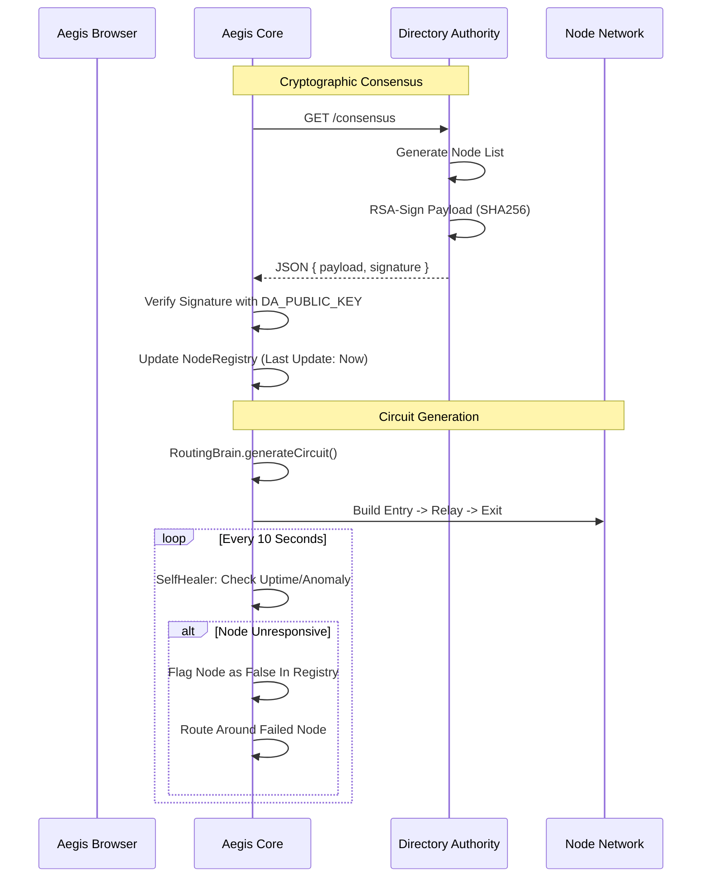

# 🛡️ Aegis Privacy Network — Phase 7: Multi-Hop Node Network

Phase 7 transitions Aegis from a static research prototype to a dynamic, cryptographically verified network. It introduces the **Directory Authority (DA)** and a **Self-Healing Registry**.

## 🏗️ Architecture Flow



## 🏛️ Directory Authority (DA)
The DA acts as the "Source of Truth." It prevents **Sybil Attacks** by ensuring only verified nodes are presented to the browser.
-   **Keys**: RSA-2048 (Private on server, Public in client).
-   **Protocol**: Signed JSON served via HTTPS/REST.

## 🩹 Self-Healing Mechanism
The network dynamically adapts to failures. If a node goes offline or its `trustScore` drops, the `SelfHealer` removes it from the active routing pool without user intervention.

---

## 🚀 How to Run Phase 7

### 1. Key Generation (One-time)
```powershell
node directory/da-keygen.js
```

### 2. Start DA Server
```powershell
node directory/da-server.js
```

### 3. Start Aegis Core
```powershell
node core/server.js
```
*Expected log: `[Directory] Successfully verified consensus...`*

---

## 🛤️ Progress Tracker
- [x] RSA Key Generation Utility
- [x] Signed Directory Authority Server
- [x] Consensus Client (Signature Verification)
- [x] Dynamic Node Registry
- [x] Background Self-Healer
- [x] Dynamic Circuit Integration
